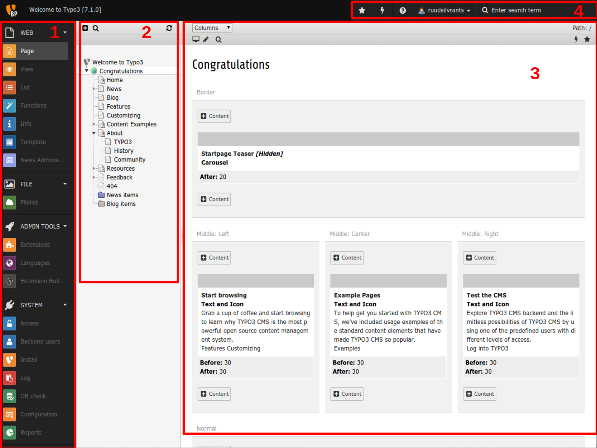

=========================================
Install a local webserver on your machine
=========================================

TYPO3 will run on a webserver and to program/experiment with TYPO3 you can install this on your machine by the following
instruction for your operating system.

Windows
-------

Windows users can install a local webserver WAMP (Windows, Apache, MySql, Php) by downloading and installing the
WAMPserver. This application can be downloaded at :

http://www.wampserver.com/en/#download-wrapper

Mac OS x:
---------

Macintosh users can install MAMP application. Download link:

https://www.mamp.info/en/downloads/

Ubuntu
------

Ubuntu users can install LAMP on their machine by installing the following packages::

	sudo apt-get install apache2 php5 libapache2-mod-php5 curl php5-ldap php5-gd php5-curl php5-mysql mysql-server php5-xdebug dnsmasq python-setuptools tree mc php-pear phpmyadmin

==============================================================
Installing instruction for TYPO3 CMS and introduction package:
==============================================================

The official installing instructions of TYPO3 and the needed requirements can be found at :
https://github.com/TYPO3/TYPO3.CMS/blob/TYPO3_7-0/INSTALL.md

For the workshop TYPO3 can be installed by cloning this repository in your webroot of your webserver.

Getting TYPO3 and the introduction package up and running
---------------------------------------------------------

The next step is to visit your web server by the browser and follow the on-screen steps to setup your installation.

In the last step of this documentation uncheck the mark 'Get/open the online distributions'. (The extensions needed for the workshop are already included). 
After this step you will be redirected to the login and after login you need to go to 'Extensions' and search for the extension 'introduction package'and install this.

You now will have you're first TYPO3 website running!

======================================================================
TYPO3 basics / common practises / structure of your TYPO3 installation
======================================================================

Before going to the next section *Personalize the introduction package* it is good to know some basics / common practises /
structure of your TYPO3 installation.

Definition list
---------------
Below here are some definitions that are quite often used and good to know ;)

Rootpage
	The root of your website (presented with the globe-icon). (In the IP 'Congratulations');
uid
	Unique identifier of a page/item/object
pid
	Parent identifier of the current page/item/object
TER
	The **T** YPO3 **E** xtension **R** epository which contains over 6000+ already available extensions free to use!

Structure of the backend
------------------------

After installing the introduction package and logging in (*yourproject.typo3.local***/typo3**) you are in the backend of TYPO3.
The structure of the backend is as follows:

1. Available backend modules
2. Page tree (not always visible)
3. Content/adjust part
4. Tools for caching/searching and user settings (since CMS 7.0)

Some familiar troubleshooting/experiences that are nice to know
---------------------------------------------------------------

Some of the problems that occurs often are because you forget some thing and below are a few question you might ask
your self if you did this:

- Did you cleared the caches?
- Is the typoScript loaded in the template object browser?
- Is the typoScript not been overwritten/ is it visible?
- Is the database up to date (check in the install tool)
- Is the extension active / are the dependencies to other extension set in your ext_emconf.php and are those active?

Adjusting extensions
--------------------

A general practise is to not adjust code of third party extensions (or changing own extensions for custom circumstances).
The reason for this is that the extensions can not be updated (your changes can be overwritten). Besides it is hard to keep
track of the adjustments and required changes if you want to use the same changes for another extension.

The common practise in adjusting an extension is to create an own extension which uses the extension you want to change,
and add your own logic to it in here.

====================================
Personalize the introduction package
====================================

Create a custom extension to adjust the introduction package:
-------------------------------------------------------------

Personalizing of the introduction package is recommended to do this in an custom extension. In the workshop the following steps of this section are 
already done, however for using this documentation as a resource the following explains the steps needs to be done to reproduce: 
To create a simple extension create a folder 'site_template' and create a file ext_emconf.php (required for TYPO3 to recognize extension) ::

	<?php

	/***************************************************************
	 * Extension Manager/Repository config file for ext "site_template".
	 ***************************************************************/

	$EM_CONF[$_EXTKEY] = array (
		'title' => 'Site template',
		'description' => 'The site template for our welcome to TYPO3 website',
		'category' => 'misc',
		'version' => '0.0.1',
		'state' => 'stable',
		'uploadfolder' => false,
		'createDirs' => '',
		'clearcacheonload' => true,in
		'author' => 'Ruud Silvrants',
		'author_email' => 't3ext@beech.it',
		'author_company' => 'beech.it,
		'constraints' =>
		array (
			'depends' => array (
				'typo3' => '6.2.9-7.99.99',
				'bootstrap_package' => '6.2.9'
			),
			'conflicts' => array (
				'fluidpages' => '*',
				'dyncss' => '*',
			),
			'suggests' => array (
				'realurl' => '1.12.8-1.12.99',
			),
		),
	);

Add also an image called ext_icon.png (16px*16px) to the folder which will be presented in the backend.

If you go to the extension manager in the backend you will see your extension and can activate your extension.

Adjust the logo of the  introduction package
--------------------------------------------

In the introduction package the logo is set in typoScript, to override those settings we add our own typoScript.

Create the following files in your extension folder (common structure for TypoScript).

Add two TypoScript files::

	Configuration/TypoScript/setup.txt
	Configuration/TypoScript/constants.txt.

Create the configuration that your typoScript can be added to your website template. This is done by creating the file
ext_tables.php in your extension folder (automatically loaded by TYPO3). This file contains the following code what actually
includes all files in the Configuration/TypoScript folder.::

	/TYPO3\CMS\Core\Utility\ExtensionManagementUtility::addStaticFile(
		$_EXTKEY,
		'Configuration/TypoScript',
		'Site template (after bootstrap package)'
	);

Include the setting to the introduction website template in the backend (needs clear of the cache). This can be done by:

- Select templates in modules
- Select rootpage
- Select (info/modify)
- Go to 'Edit the whole template record'
- Include your static in the tab 'includes'
- Adjust order that the site_template comes **after** bootstrap_package
- Save changes

.. note::
	**In the 'info/modify' -> 'Edit the whole template record' TypoScript could be overwritten in the fields 'settings' or 'constants'.
	The values can be deleted because we are going to set this in our site_template.**

At this point the TypoScript files are loaded and we can adjust the settings to use our own logo instead.

The typoScript setting of the introduction package to use the logo (can be found by looking into the code OR in the
Template Object browser of the rootpage) is the following::

	page.logo.file = EXT:bootstrap_package/Resources/Public/Images/BootstrapPackage.png

The one thing we need to do is to override to use the path to the logo that we add to our site_template::

	page.logo.file = EXT:site_template/Resources/Public/Images/WelcomeLogo.png

Additionally override also the height and width::

	page {
		logo {
			file = EXT:site_template/Resources/Public/Images/WelcomeLogo.png
			height = 60
			width = 210
		}
	}

At last we need to add the WelcomeLogo.png to the folder Resources/Public/Images (common practise/structure to keep the resources).

When you flush the caches and reload the website your logo should be visible.

Adjust the colors/css
---------------------

The default color scheme / css styling is perhaps not as desired. To adjust this in TYPO3 you can add your own css styles.

First step is to create an css file to adjust the color of the menu bar to the economical green color. This file is called
main.css and is located at Resources/Public/Css. Content of this file to change the menubar to green is::

	.navbar{
		background-color: green;
	}

Second step is to configure/setup TYPO3 to include this file at every page. In the created setup.txt file you have to
 add the following line to include your main.css file.

	page.includeCSS.all = EXT:site_template/Resources/Public/Css/main.css

After clearing the cache, your menu bar has an economical greenish background color.

Adding some news to the website
-------------------------------

One commonly used functionality of a website is presenting some news/blog/information presented in a list with a detail view.
In TYPO3 the extension 'news' offers the functionality to present this. In this section it will be explained how to add
this to your website, and how to adjust the view of this.

The news extension can be downloaded at http://typo3.org/extensions/repository/view/news and installed by the extension manager.
Other option is to search for this extension manager (select option 'get extensions') and install it from here.

When the extension is installed there are a few configuration steps required to show news on your website.

Create a folder in your pagetree and select news in the field 'use as a container'.

.. note::
	**The creation of the folder is not a recommendation, you can add news item(s) to normal pages but this is unorganized!**

Create a (few) news items in this folder.

.. note::
	**Select the list module and you folder and press 'create record' in the content view.**

Create two pages in the page tree; one for the list-view and one for the detail-view.

.. tip::
	**The detail-view can be hide in the menus because user are redirect from the list-view and accessing this page will
	result in an error because the page does not know what to show.
	*(You can hide the detail view in the edit page mode.)* **

Presenting the list of news items is done by adding and configuring the news plugin on the created page. The plugin can be
added in the page module of you page and press "add content". In the tab plugins you will find the news system and by
selecting this you wil be redirected to the configuration.

The configuration of this plugin are:

* Configure what to display: *select 'listview (without overloading detail view)*
* Configure where your news items are stored: *Enter/search for your folder/container in the field 'select startingpoint'*
* Configure where to redirect to for an detail page of the news items: *Enter/search for your detail page at the field 'detail pageId'*
* Save your changes

.. note::
	**These configuration can be added by editing your plugin visible in the page/list module**

Presenting the detail of a news items is done by adding another news plugin to your detail page and configure the
starting point to the same folder as previous and selecting 'detail-page' in the field 'what to display'.

When visiting the website (cleared the cache / set the page on visible?) you should see your news items.

The complete user manual as other information about this extension can be found at:
http://typo3.org/extensions/repository/view/news

Adjusting the view(s) of the news extension
-------------------------------------------

After you installed the news extension you probably also want to adjust the view of the news list/ detail-page to your
needs. To do this a few steps are needed and you can adjust the templates of news in the site_template.

In adjusting the logo, the typoScript is already loaded and we only have to configure the TypoScript to let TYPO3 know
to use your created templates, instead of the templates of news. (If you're template(s) are not found, TYPO3 falls back
to the template(s) of news.

The TypoScript to inform TYPO3 to use our templates the following has to be added to your setup.txt

.. code:: php

	#overwride the news template:
	plugin.tx_news {
		view {
			templateRootPaths {
				102 = EXT:site_template/Resources/Private/Ext/News/Templates/
			}

			partialRootPaths {
				102 = EXT:site_template/Resources/Private/Ext/News/Partials/
			}

			layoutRootPaths {
				102 = EXT:site_template/Resources/Private/Ext/News/Layouts/
			}
		}
	}

.. note::
	**Better practise is to created an folder 'Lib' in the TypoScript folder and create a file for every extension you
	change the settings for. To let TYPO3 use all the contents of the folder add the following line to your setup.txt::

		# Lib
		<INCLUDE_TYPOSCRIPT: source="DIR:EXT:site_template/Configuration/TypoScript/Lib/">

	This keeps more structure of your extension and is more maintainable!**

Create the corresponding folders in your extension.

Adjusting a template requires only to copy the file (and structure from the rootPath e.g. News/detail.html) and making
changes to it.

After clearing the cache you can see the made changes on your website.

.. note::
	**When no changes are visible, make sure that the path AND filename relative to the given rootPaths are the same, else
	the template of news is taken.**

Create your first custom extension
----------------------------------

**The case of the first extension is a simple blog system to create, update, edit, delete blogitem(s) on the website as
well in the backend.
On the website there should be an overview of al blog items as well an detail view of every item.
A blog item consists of a title, teaser, date and a message, where the date will be automatically will be set when creating
the blog item.**

Creating extensions can easily be kick started by the extension builder. The extension builder can be found at TER but
the version compatible for CMS 7.0 is not yet released in the TER. Therefore use the following link to get it:
https://github.com/TYPO3-extensions/extension_builder.git

The manual of the extension builder can be found at:
http://docs.typo3.org/typo3cms/extensions/extension_builder/

Once you have installed the extensionbuilder we can use the backend module to create our simple_blog extension.

The entered information in the demo is as follows:

- Name: Simple blog
- Vendor name: Yourcompany
- Key: simple_blog
- Descr: My first extension, a nice blogging system
- More options: keep defaults
- Add a person: enter your personal information
- Add a front end plugin:
- Name: Listblog
- Key: list

After this create a 'New Model Object', in this case the Blog object.

- Mark the "Is aggregate root" *This creates a repository and creates the mapping*
- Check the required action that should be possible
- At the properties we want the following:

- title (String)
- date (DateTime(timestamp))
- teaser (String)
- message (Rich text)

Save your extension and install this in the extension manager.

If you go to the typo3conf/ext you will see the created extension simple_blog. Under the folder Classes/Domain/Model the
Blog is created with default getters and setters. In here we create a constructor that sets the date on creation of an item.
The following constructor is created which sets the date::

	/**
	 * Constructor of a new Blog which automatically sets the date on today
	 */
	public function __construct() {
		$this->date = new \DateTime();
	}

The other thing we need to adjust is that a web user does not have to enter the field. In the folder
Resources/private/Partials/Blog/FormFields.html the following has to be removed::

	<label for="date">
	<f:translate key="tx_simpleblog_domain_model_blog.date" />
	</label> 
	<f:form.textfield property="date"  value="{blog.date->f:format.date()}" /> 

.. note::
	**The following steps assume that you have already done/read the section about adding the news system, due the fact
	that some steps are already explained over there.**

If this is all setup you have to create a folder/storage for the blog items and create a page containing your plugin.

As different with the news extension in creating a new content element the plugin is under 'General plugin' and after
this go to the tab 'Plugin' and select your plugin. ('ListBlog' or the name you specified before in the extension builder)

At last enter/find the record of your folder/container and set this in the field 'Record Storage Page'.

When you cleared the caches and visit your website you can see your first blog system. In the backend you can also adjust
your blog items in your container or add new ones if desired.
